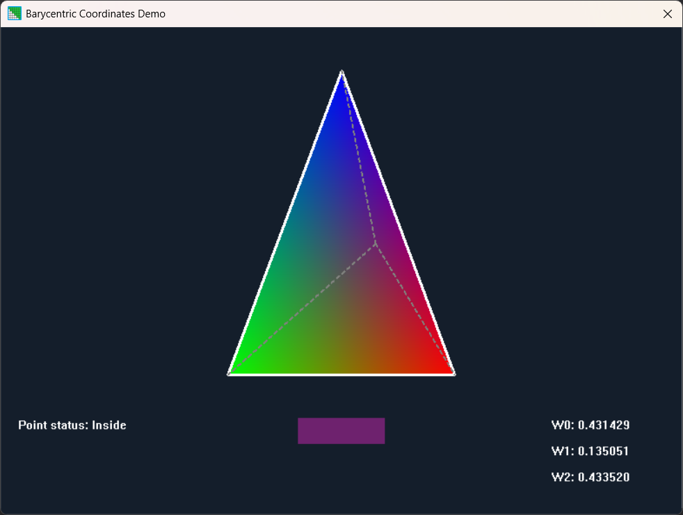
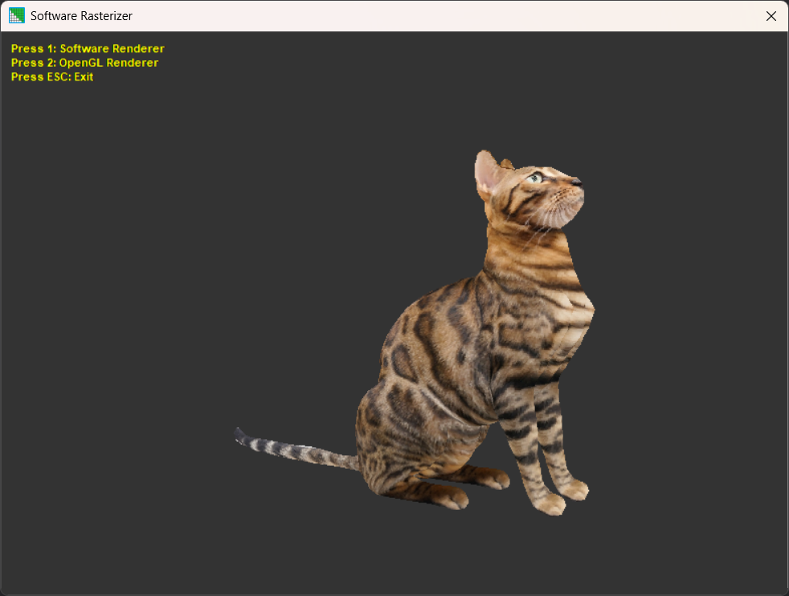

# 3D-Rasterization
Personal work, documents and demos around 3D rasterization rendering technique.

# Space Transform
This demo shows how 3D coordinates can be transformed to 2D screen coordinates.

# Barycentric Coordinates
This demo shows how Barycentric coordinates can be calculated above a triange, also how the resulting weights may be used for e.g. color blending.

# Software Rasterizer
This demo shows a minimal but working software rasterizer. It loads a WaveFront asset and render it, either by using the software rendering pipeling, or by using  OpenGL for the rendering. The both rendering methods may be switched by pressing the 1 or 2 buttons.

# Documentation
Please read the Wiki pages of this project if you want to know further about rasterization.